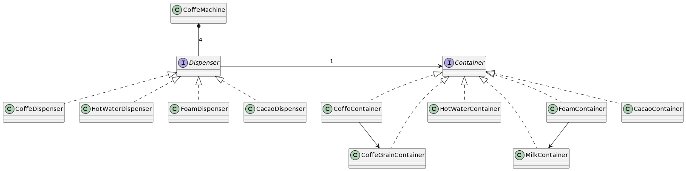

# Trabajo Práctico N° 1 - CoffeeGPT

* **Autor**: [Alejo Villores](https://github.com/alejovillores)
* **Fecha** de entrega: 3/5/2023

### _Modelo y Resolución_ 

Desglozando el enunciado noto que N dispensadores que tengo por cafetera son en realidad uno por cada accion ya que por la condicion de que "Un solo dispenser a por vez puede tomar ingredientes de cada contenedor, es decir, no es posible por ejemplo que dos disponsers tomen café concurrentemente" me hace pensar que como mucho puedo tener a teniendo cada dispensador funcionando en simultaneo.

Para que la cafetera pueda procesar otro pedido, todos los dispensers deben haber terminado. Para eso, lo que se pensó es usar unas variables de condicion que espere a que todos los dispensers den ok.

Primero comienzo con una cafeteria con 4 dispensers y recurso infinito.\
El diagrama pensado fue el siguiente:

Donde habrá un Thread por Dispenser y un thread por Container.

### _Test de Aceptacion_

### _Test Unitarios_ 

Para correr los test unitarios se debe ejecutar

`cargo test`

## _Extra_

Para ejecutar ``cargo fmt``, ``cargo clippy`` y ``cargo test`` todo junto, se puede ejecutar `./pre-commit.sh`
