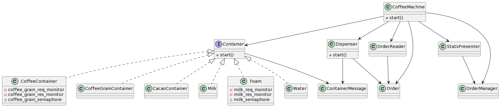

# Trabajo Práctico N° 1 - CoffeeGPT

* **Autor**: [Alejo Villores](https://github.com/alejovillores)
* **Fecha** de entrega: 3/5/2023

### _Modelo y Resolución_ 

**[deprecated]**\
Desglozando el enunciado noto que N dispensadores que tengo por cafetera son en realidad uno por cada accion ya que por la condicion de que "Un solo dispenser a por vez puede tomar ingredientes de cada contenedor, es decir, no es posible por ejemplo que dos dispensers tomen café concurrentemente" me hace pensar que como mucho puedo tener a cada dispensador funcionando en simultaneo.

Para que la cafetera pueda procesar otro pedido, todos los dispensers deben haber terminado. Para eso, lo que se pensó es usar unas variables de condicion que espere a que todos los dispensers den ok.

Primero comienzo con una cafeteria con 4 dispensers y recurso infinito.\
El diagrama pensado fue el siguiente:

Donde habrá un Thread por Dispenser y un thread por Container.

El primer dispenser en desarrollarse es el de Cafe molido, con sus contenedores de cafe molido y granos de cafe.
Luego se cosntruira el dispenser de leche y espuma. Por ultimo el de cacao y agua.

Se utilizan diferentes estructuras de sincronizacion, tales como:
 - Monitores para comunicar la cafetera con los dispensers y viceversa
 - Monitores para comunicar los diferentes contenedores
 - Barreras para que todos los dispensers antes de comenzar lean el valor que les corresponde

Hay contenedores que necesitan a su vez comunicarse con otros a la hora de rellenar sus unidades. Tambien deben saber si ese contenedor en particular quedó vacio.

Como estos contenedores que solo son se sincronizan con otro contenedor que depende de ellos, veo necesario que este contenedor sea creado por el contenedor hijo.

Por ultimo, se tiene a su vez un hilo por fuera de los dispensers que corresponde a un generador de datos estadisticos. Cada N seg imprime por stdout ciertos datos de la maquina. 

---

Luego de varias consultas por el canal de comunicacion de Discord, note que mi comprension del enunciado no era el correcto, por lo que tuve que cambiar mi modelo.

Ahora le idea esta en que hay N dispensers que **todos** toman una orden y la realizan. Toman de a un recurso a la vez y cada contenedor de recurso puede aceptar a un solo dispenser a la vez para suministrarle la cantidad de recurso que necesita.

El nuevo modelo planteado queda de la siguiente manera

Se utilizó lo realizado para refactorizar y migrar al modelo planteado

### _Dificultades al modelar_

Se noto, que dado que los contenedores deben comunicarse entre si por falta de suministro que no se recargue, se deben hacer un especie de request y response entre ellos. Por ejemplo, el contenedor de cafe molido, en caso de no tener cafe, debe enviarle una señal al contenedor de gramos de cafe para que este le proveea los gramos necesarios. Si este contenedor no tiene mas gramos para proveer, debe avisar al contedor de cafe molido, y este avisar al dispenser ya que no se podrá realizar mas cafe.

### _Test de Aceptacion_

> TODO: preguntar como hacerlos

### _Test Unitarios_ 

Para correr los test unitarios se debe ejecutar

`cargo test`

## _Extra_

Para ejecutar ``cargo fmt``, ``cargo clippy`` y ``cargo test`` todo junto, se puede ejecutar `./pre-commit.sh`
